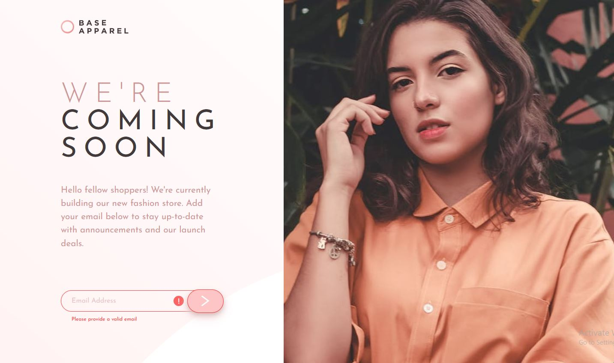

# Frontend Mentor - Base Apparel coming soon page solution

This is a solution to the [Base Apparel coming soon page challenge on Frontend Mentor](https://www.frontendmentor.io/challenges/base-apparel-coming-soon-page-5d46b47f8db8a7063f9331a0). Frontend Mentor challenges help you improve your coding skills by building realistic projects.

## Table of contents

- [Overview](#overview)
  - [The challenge](#the-challenge)
  - [Screenshot](#screenshot)
  - [Links](#links)
- [My process](#my-process)
  - [Built with](#built-with)
  - [What I learned](#what-i-learned)
  - [Continued development](#continued-development)
  - [Useful resources](#useful-resources)
- [Author](#author)

**Note: Delete this note and update the table of contents based on what sections you keep.**

## Overview

### The challenge

Users should be able to:

- View the optimal layout for the site depending on their device's screen size
- See hover states for all interactive elements on the page
- Receive an error message when the `form` is submitted if:
  - The `input` field is empty
  - The email address is not formatted correctly

### Screenshot

### Links

- Solution URL: [https://github.com/Robert-Rynard/base-apparel-coming-soon-react](https://github.com/Robert-Rynard/base-apparel-coming-soon-react)
- Live Site URL: [https://robert-rynard.github.io/base-apparel-coming-soon-react/](https://robert-rynard.github.io/base-apparel-coming-soon-react/)

## My process

### Built with

- Semantic HTML5 markup
- Flexbox
- CSS Grid
- Mobile-first workflow
- [React](https://reactjs.org/) - JS library

### What I learned

During this project I was able to put into practice implementing the challenges layout by using CSS Grid and grid-areas to make the site responsive on all screen sizes. I was also able to practice using the useState hook in React and programming logic to validate the email entered in the input.

### Continued development

This was my first time using grid for the whole site layout as well as implementing grid-areas to help with the media queries. This was challenging at first as there were a lot of new I had not used before that did not always react in the ways I believed they would. I ended up scrapping the css and starting over three times as my first few implementations were messy and confusing. There is still a lot to learn about grid but I'm glad I stuck with it and was able to get a responsive layout that I was happy with.

### Useful resources

- [CSS-Tricks Grid Guide](https://css-tricks.com/snippets/css/complete-guide-grid/) - Reading through this helped me better understand all of the grid properties and how they affected each other.

## Author

- Website - [Robert Rynard](https://github.com/Robert-Rynard)
- Frontend Mentor - [@Robert-Rynard](https://www.frontendmentor.io/profile/Robert-Rynard)
- Twitter - [@robert_rynard](https://www.twitter.com/robert_rynard)
